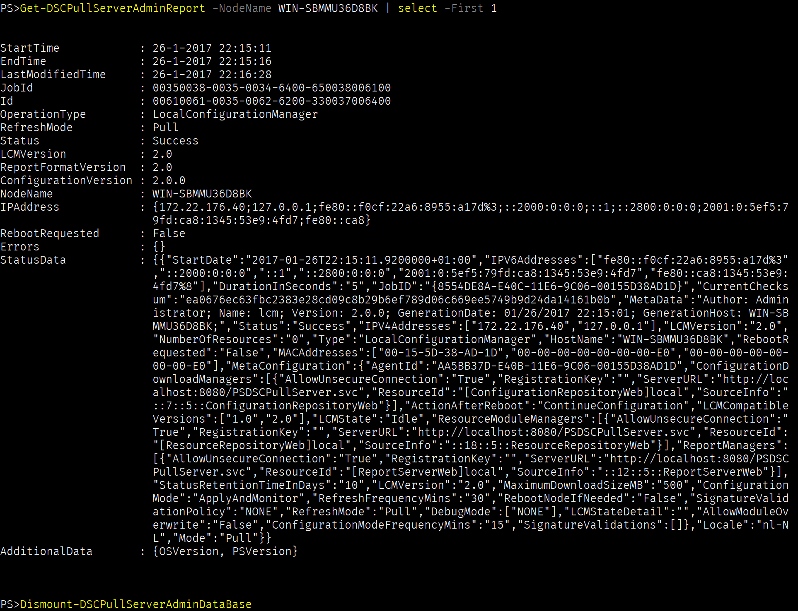

# DSCPullServerAdmin

A module to mount the DSC Pullserver edb database file to get, manipulate and remove data from it. Secondly (working on now, see [#5](https://github.com/bgelens/DSCPullServerAdmin/issues/5)), the module can be used to move data from the edb to the newly supported SQL database.

Initially, the alternate mdb database was also in scope for this module to process but unfortunately the required odbc driver is 32 bits only.

**Note that the current state of this module is very alpha / experimental. Use at your own risk and if possible always create a backup!**

Primary goals:

- [x] Access reports more easily
- [x] Access v2 registered node information
- [x] Access v1 node information
- [x] Change node ConfigurationName server side\
  Thanks to PR [#4](https://github.com/bgelens/DSCPullServerAdmin/pull/4) from [@rdbartram](https://github.com/rdbartram)!
- [ ] Create new SQL Database
- [ ] Move / Migrate data from edb to SQL Database




## SQL Interfacing

Basic interfacing existing SQL DB:

```powershell
Connect-DSCPullServerAdminSQLInstance -InstanceName myhost\myinstance -Credential (Get-Credential)
Set-DSCPullServerAdminSQLDatabase -Name DSC
Get-DscPullServerAdminSQLRegistration -Name LCMClient
```

Create new DB and import data from edb:

```powershell
Connect-DSCPullServerAdminSQLInstance -InstanceName myhost\myinstance -Credential (Get-Credential)
New-DSCPullServerAdminSQLDatabase -Name DSC02 #new will auto connect
Mount-DSCPullServerAdminDatabase -ESEPath .\Devices.edb
Import-DSCPullServerAdminSQLDataFromEDB #default skip if exist, -Force to overwrite
```

Connect existing DB and import data from edb:

```powershell
Connect-DSCPullServerAdminSQLInstance -InstanceName myhost\myinstance -Credential (Get-Credential)
Set-DSCPullServerAdminSQLDatabase -Name DSC
Mount-DSCPullServerAdminDatabase -ESEPath .\Devices.edb
Import-DSCPullServerAdminSQLDataFromEDB #default skip if exist, -Force to overwrite
```