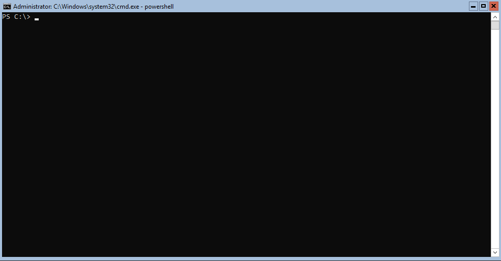

# DSCPullServerAdmin

A module to mount the DSC Pullserver edb database file to get, manipulate and remove data from it. Secondly (working on now, see [#5](https://github.com/bgelens/DSCPullServerAdmin/issues/5)), the module can be used to move data from the edb to the newly supported SQL database.

Initially, the alternate mdb database was also in scope for this module to process but unfortunately the required odbc driver is 32 bits only.

**Note that the current state of this module is very alpha / experimental. Use at your own risk and if possible always create a backup!**

Primary goals:

- [x] Access reports more easily
- [x] Access v2 registered node information
- [x] Access v1 node information
- [x] Change node ConfigurationName server side\
  Thanks to PR [#4](https://github.com/bgelens/DSCPullServerAdmin/pull/4) from [@rdbartram](https://github.com/rdbartram)!
- [x] Create new SQL Database
- [x] Move / Migrate data from edb to SQL Database



## SQL Interfacing

Basic interfacing existing SQL DB:

```powershell
Set-DefaultDSCPullServerConnection -SQLServer myhost\myinstance -SQLCredential (Get-Credential)
Get-DSCPullServerAdminRegistration -NodeName LCMClient
```

Create new DB and import data from ese:

The default is from ESE to SQL and will move registred clients of version 1 and 2

```powershell
New-DSCPullServerAdminSQLDatabase -SQLServer myhost\myinstance -SQLCredential (Get-Credential) -DBFolderPath D:\DSCDatabase
Import-DSCPullServerAdminData -SQLServer myhost\myinstance -SQLCredential (Get-Credential) -Database DSC -ESEFilePath D:\DSCService\devices.edb 
```

Connect existing DB and import data from ese:

```powershell
Set-DefaultDSCPullServerConnection -ESEFilePath D:\DSCService\devices.edb
Get-DSCPullServerAdminRegistration -NodeName LCMClient
```

Connect adhoc to SQL or ESE

```powershell
Get-DSCPullServerAdminRegistration -NodeName LCMClient1 -SQLServer myhost\myinstance
Get-DSCPullServerAdminRegistration -NodeName LCMClient2 -ESEFilePath D:\DSCService\devices.edb
```
