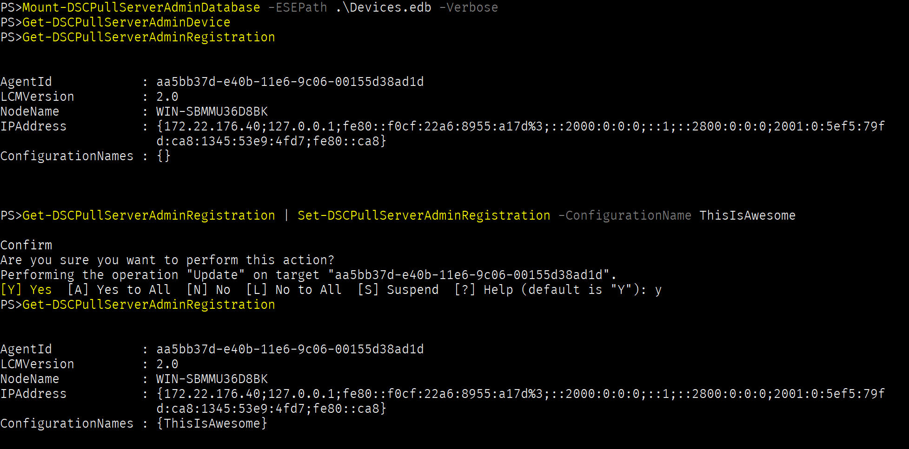

#DSCPullServerAdmin
An attempt to interface with DSC Pull Server devices.edb

Primary goals:
* Access reports more easily
* Access v2 registered node information
* Access v1 node information
* Change node ConfigurationName server side

Secondary goals:
* Do the same with mdb :-)

